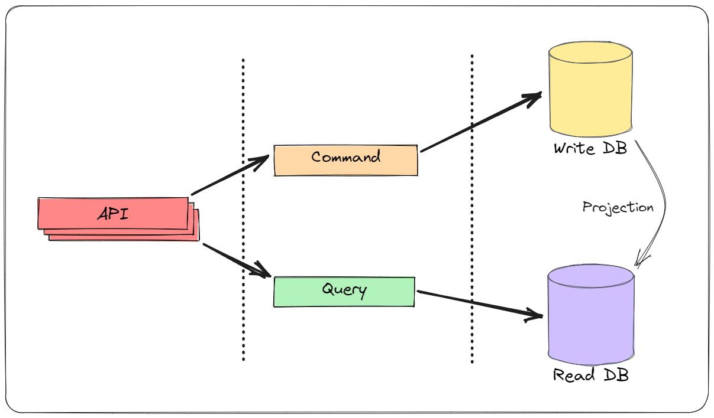

The CQRS pattern separates the writes and reads in the application.

This separation can be logical or physical and has many benefits:

- Complexity management
- Improved performance
- Scalability
- Flexibility
- Security

## CQS

_A command (procedure) does something but does not return a result. A Query (funtion or attribute) returns a result but does not change the state._

**CQS** stands for Command Query Separation. It's a term coined by Bertrand Meyer in his book Object-Oriented Software Construction.

The basic premise of CQS is splitting an object's methods into Commands and Queries.

- Commands: Change the state of a system but don't return a value
- Queries: Return a value and don't change the state of the system (no side effects)

CQS is a principle. You can follow this principle if it makes sense, but be pragmatic.

CQRS is the evolution of CQS. CQRS works on the architectural level. At the same time, CQS works on the method (or class) level.

## CQRS

_The fundamental difference is that in CQRS objects are split into two objects, one containing the commands one containing the Queries_

**CQRS** stands for Command Query Responsibility Segregation. The CQRS pattern uses separate models for reading and updating data. The benefits of using CQRS are complexity management, improved performance, scalability, and security.

Having separate models for commands and queries allows you to scale them independently.



## What is MediatR?

**MediatR** is a NuGet package for .NET applications that helps to implement the Mediator pattern and MediatR can be used as a useful tool to implement CQRS in a .NET application.

MediatR pattern helps to reduce direct dependency between multiple objects and make them collaborative through MediatR.

## Implementing CQRS with MediatR

Install following packages in the application layer

```csharp
Install-Package MediatR
Install-Package MediatR.Extensions.Microsoft.DependencyInjection
```

Implementing CQRS with MediatR has two components:

- Defining your command or query class
- Implementing the respective command or query handler

`ISender` interface to Send the command or query. MediatR takes care of routing the command or query to the respective handler.

```csharp
public class AuthenticationController : ApiController
{
    private readonly ISender _mediator;

    public AuthenticationController(ISender mediator)
    {
        _mediator = mediator;
    }

    [HttpPost("register")]
    public async Task<IActionResult> Register(RegisterRequest request)
    {
        var command = new RegisterCommand(request.FirstName,
            request.LastName,
            request.Email,
            request.Password);


        ErrorOr<AuthenticationResult> authResult = await _mediator.Send(command);

        return authResult.Match(
            result => Ok(MapAuthResult(result)),
            errors => Problem(errors));

    }

}
```

Define the commands and queries that we’ll need for the system.

```csharp
public record RegisterCommand(
    string FirstName,
    string LastName,
    string Email,
    string Password) : IRequest<ErrorOr<AuthenticationResult>>;
```

Define a handler for each request.

```csharp
public class RegisterCommandHander :
        IRequestHandler<RegisterCommand, ErrorOr<AuthenticationResult>>
{
    private readonly IJwtTokenGenerator _jwtTokenGenerator;

    private readonly IUserRespository _userRepository;

    public RegisterCommandHander(IJwtTokenGenerator jwtTokenGenerator,
    IUserRespository userRepository)
    {
        _jwtTokenGenerator = jwtTokenGenerator;
        _userRepository = userRepository;
    }

    public async Task<ErrorOr<AuthenticationResult>> Handle(RegisterCommand command, CancellationToken cancellationToken)
    {
       //...
    }
}
```

Once you have added the MediatR package, you need to add the MediatR middleware to your application.

```csharp
public static IServiceCollection AddApplication(this IServiceCollection services)
{
    services.AddMediatR(typeof(DependencyInjection).Assembly);
    return services;
}
```
