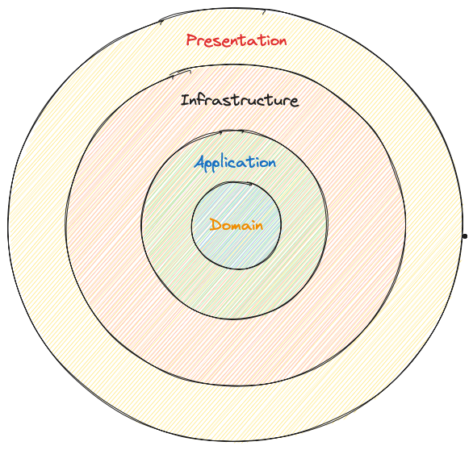

**Clean Architecture** is a popular approach to structuring your application.

It's a layered architecture that splits the project into four layers:

- Domain
- Application
- Infrastructure
- Presentation

Each of the layers is typically one project in your solution.

Here's a visual representation of the Clean Architecture:

## Domain Layer

The **Domain layer** sits at the core of the **Clean Architecture**. Here we define things like: entities, value objects, aggregates, domain events, exceptions, repository interfaces, etc.

_Note_:Domain layer is not allowed to reference other projects in your solution

## Application Layer

The **Application layer** sits right above the Domain layer. It acts as an orchestrator for the Domain layer, containing the most important use cases in your application.

You can structure your use cases using services or using commands and queries.

## Infrastructure Layer

The **Infrastructure layer** contains implementations for external-facing services.

Some of the examples

- Databases - PostgreSQL, MongoDB, SQL
- Identity providers - Auth0, Keycloak
- Emails providers
- Storage services - Azure Blob Storage
- Message queues - Rabbit MQ, Kafka

## Presentation Layer

The **Presentation layer** is the entry point to our system. Typically, you would implement this as a Web API project.

The most important part of the Presentation layer is the `Controllers`, which define the API endpoints in our system.
